# OSFI CAR RAG Agent with Mathematical Scoring

A sophisticated Retrieval-Augmented Generation (RAG) agent for OSFI (Office of the Superintendent of Financial Institutions) Capital Adequacy Ratio regulatory compliance and analysis, featuring advanced mathematical quality assessment.

## 🎯 Overview

This project implements an intelligent regulatory assistant that provides expert guidance on OSFI CAR requirements and Basel III reforms. The agent features complete reasoning transparency, mathematical quality scoring, and comprehensive batch analysis capabilities.

### 🆕 Latest Features (v2.0)
- **Mathematical Quality Scoring**: 6-metric assessment system for response quality
- **Citation-Based Relevance**: Advanced detection of regulatory document usage
- **Production-Ready**: Comprehensive testing with 100% success rate
- **Enhanced Reports**: Quality grades and executive summaries

## �� Key Features

### Core Capabilities
- **Intelligent Document Retrieval**: Semantic search across OSFI CAR regulatory documents
- **Expert Regulatory Guidance**: Comprehensive answers with specific regulatory references
- **Complete Reasoning Transparency**: Visible agent thinking and decision-making process
- **Mathematical Quality Assessment**: 6-metric scoring system with quality grades
- **Batch Analysis**: Process multiple questions with detailed scoring reports
- **Performance Monitoring**: Detailed metrics and analytics

### Mathematical Scoring System
- **Relevance Metrics**: Keyword overlap, citation-based relevance, domain relevance
- **Completeness Metrics**: Information density, question coverage, reference quality, explanation depth
- **Quality Grades**: A+ (Excellent) to C (Needs Improvement)
- **Production Tested**: 0.805/1.0 average quality on 9-question regulatory test set

### Agent Types
- **Enhanced Agent** (`osfi_car_enhanced_reasoning_with_scoring.py`): Real-time chat with quality scoring
- **Batch Analyzer** (`osfi_batch_analysis_with_scoring.py`): Comprehensive analysis with quality reports
- **Legacy Versions**: Archived original versions without scoring

## 📋 Requirements

- Python 3.8+
- Google Gemini API key
- OSFI CAR PDF documents

### Dependencies
```bash
pip install langchain langchain-community pypdf google-generativeai langgraph langchain-huggingface
```

## 🔧 Setup

1. **Clone and Setup**:
   ```bash
   git clone <repository>
   cd pdf
   python -m venv .venv
   source .venv/bin/activate  # On Windows: .venv\Scripts\activate
   pip install -r requirements.txt
   ```

2. **Configure API Key**:
   Create a `.env` file:
   ```
   gemini_api_key=YOUR_GOOGLE_API_KEY
   ```

3. **Add OSFI Documents**:
   Place OSFI CAR PDF files in the `osfi car/` directory

## 🎮 Usage

### Enhanced Interactive Mode with Quality Scoring
```bash
source .venv/bin/activate
python osfi_car_enhanced_reasoning_with_scoring.py
```

### Batch Analysis with Mathematical Scoring
```bash
# Process questions from file with quality assessment
python osfi_batch_analysis_with_scoring.py -q test_questions.txt -o scoring_report.md

# Custom title and comprehensive analysis
python osfi_batch_analysis_with_scoring.py -q questions.json -o analysis.md --title "OSFI Compliance Review with Quality Assessment"

# Example: Run the standard test suite
python osfi_batch_analysis_with_scoring.py test_questions.txt -o test_results.md --title "Standard Quality Test"
```

### Legacy Versions (Archived)
```bash
# Original versions without scoring (use for comparison)
python osfi_car_enhanced_reasoning.py     # Original reasoning agent
python osfi_batch_analysis.py             # Original batch analyzer
```

## 📊 Architecture

### Enhanced Agent Workflow with Mathematical Scoring

```mermaid
graph TD
    A[User Query] --> B[🧠 LLM Analysis]
    B --> C{Decision Point}
    
    C -->|Complex Query| D[🔍 Document Retrieval]
    C -->|Simple Query| E[💭 Direct Response]
    
    D --> F[📊 Retrieval Quality Scoring]
    F --> G[📝 Enhanced Response Generation]
    E --> G
    
    G --> H[🎯 Mathematical Quality Assessment]
    H --> I[📈 Relevance Scoring]
    H --> J[📋 Completeness Scoring]
    
    I --> K[Final Response with Quality Grade]
    J --> K
    
    K --> L[📄 Reasoning Log with Scores]
    
    style H fill:#e1f5fe
    style I fill:#f3e5f5
    style J fill:#f3e5f5
    style K fill:#e8f5e8
```



### Detailed Agent Workflow
1. **Query Analysis**: LLM evaluates question complexity and regulatory scope
2. **Decision Routing**: Determines if document retrieval is necessary
3. **Document Retrieval** (if needed): Semantic search across OSFI regulatory documents
4. **Retrieval Scoring**: Quality assessment of retrieved content relevance
5. **Response Generation**: Enhanced LLM response using retrieved context
6. **Mathematical Assessment**: 6-metric quality evaluation system
7. **Quality Grading**: A+ to C grade assignment with detailed breakdown
8. **Transparent Logging**: Complete reasoning process with scoring details

### Key Components
- **LangGraph State Machine**: Manages agent workflow and decision routing with enhanced state management
- **Vector Store**: Semantic search across 634 document chunks (2000 tokens each)
- **Gemini 1.5 Pro**: Advanced reasoning and regulatory analysis
- **Mathematical Scorer**: 6-metric quality assessment system with citation detection
- **Reasoning Logger**: Complete transparency into agent thinking with quality scores

### Retrieval Configuration
- **Chunk Size**: 2,000 tokens with 100-token overlap
- **References per Query**: 6 document chunks
- **Typical Retrieval**: 2,000-3,000 words of regulatory content
- **Performance**: 1-2 second retrieval times

## 📈 Production Performance (v2.0)

### Quality Assessment Results
- **Questions Processed**: 9 regulatory queries (100% success rate)
- **Average Quality Score**: 0.805/1.0 (A grade)
- **Quality Grade Distribution**: 66.7% A, 22.2% B+, 11.1% B
- **Total Reasoning Steps**: 135 steps with complete transparency

### Scoring Breakdown
- **Average Relevance**: 0.823/1.0 (excellent keyword and citation matching)
- **Average Completeness**: 0.786/1.0 (comprehensive regulatory coverage)
- **Citation Detection**: 0.248-0.968 range (regulatory reference quality)
- **Processing Time**: ~53 seconds average per question

## 📝 Example Questions

- "What is the definition of default and the associated capital treatment of defaulted exposure?"
- "What is the minimum Common Equity Tier 1 capital ratio requirement?"
- "How do you calculate risk-weighted assets for credit risk?"
- "Explain the capital conservation buffer and when it applies"

## 📁 Project Structure

```
pdf/
├── osfi_car_enhanced_reasoning_with_scoring.py  # 🚀 Enhanced agent with quality scoring
├── osfi_batch_analysis_with_scoring.py          # 🚀 Batch analyzer with scoring reports
├── test_questions.txt                           # Standard 9-question test suite
├── test_questions_citation_scoring_report.md    # Latest quality assessment report
├── test_enhanced_reasoning.py                   # Testing framework
├── README_batch_analysis.md                     # Detailed batch tool guide
├── sample_questions.json                        # JSON format examples
├── osfi car/                                    # OSFI PDF documents directory
└── archive/                                     # Archived versions and development files
   ├── old_versions/                             # Original scripts without scoring
   ├── old_reports/                              # Previous analysis reports
   ├── scoring_development/                      # Development scoring scripts
   └── ARCHIVE_INDEX.md                          # Complete development history
```

## 🧠 Reasoning Transparency with Quality Scoring

The enhanced agent shows complete decision-making process with mathematical assessment:

```
🧠 Agent Thinking Process [Step 3] (21:26:00)
   Action: Evaluating user query and determining response strategy
   Reasoning: Need to analyze question complexity and decide whether 
            regulatory document retrieval is necessary

🔍 Agent Thinking Process [Step 8] (21:26:13)
   Action: Searching OSFI documents for: 'definition of default AND defaulted exposures'
   Reasoning: Semantic search will find most relevant regulatory sections
   Retrieval Scores: {'relevance': '1.000', 'keyword_overlap': '1.000', 'quality_level': 'Excellent'}

🎯 Agent Thinking Process [Step 12] (21:26:40)
   Action: Response Quality Assessment: A+ (Excellent) (0.916/1.0)
   Reasoning: Mathematical analysis shows response quality at 0.916/1.0
   Relevance Scores: {'keyword_overlap': '1.000', 'citation_relevance': '1.000', 'overall_relevance': '1.000'}
   Completeness Scores: {'info_density': '1.000', 'reference_quality': '1.000', 'explanation_depth': '0.371'}
```

## 📊 Enhanced Generated Reports

Batch analysis creates comprehensive Markdown reports with mathematical scoring:

### Executive Summary
- Quality score distribution and averages
- Processing statistics and performance metrics
- Grade distribution analysis (A+, A, B+, B, C)

### Detailed Question Analysis
- Complete step-by-step reasoning logs
- Mathematical quality breakdown per question
- Relevance and completeness scoring details
- Regulatory guidance with specific OSFI references

### Quality Assessment Features
- **Overall Quality Scores**: 0.0-1.0 scale with letter grades
- **Relevance Metrics**: Keyword overlap, citation relevance, domain relevance
- **Completeness Metrics**: Information density, question coverage, reference quality, explanation depth
- **Scoring Methodology**: Transparent mathematical formulas and weighting

## 🔬 Testing

```bash
# Test enhanced reasoning with scoring
python test_enhanced_reasoning.py

# Run standard quality assessment test suite
python osfi_batch_analysis_with_scoring.py test_questions.txt -o quality_test.md --title "Quality Assessment Test"

# Interactive demo with real-time scoring
python osfi_car_enhanced_reasoning_with_scoring.py

# Compare legacy vs enhanced versions
python osfi_batch_analysis.py -q test_questions.txt -o legacy_report.md     # Original
python osfi_batch_analysis_with_scoring.py test_questions.txt -o enhanced_report.md  # With scoring
```

### Test Results Summary
- **Test Suite**: 9 regulatory questions covering OSFI CAR requirements
- **Success Rate**: 100% (9/9 questions processed successfully)
- **Average Quality**: 0.805/1.0 (A grade)
- **Performance**: ~53 seconds average processing time
- **Quality Distribution**: 66.7% A grade, 22.2% B+ grade, 11.1% B grade

## 🤝 Contributing

1. Fork the repository
2. Create a feature branch
3. Add tests for new functionality
4. Submit a pull request

## 📄 License

This project is for educational and compliance purposes. Ensure proper licensing for commercial use.

## ⚠️ Disclaimer

This tool provides regulatory guidance based on OSFI documents but should not replace professional regulatory advice. Always consult with qualified professionals for implementation decisions.

---

**Built with LangChain, LangGraph, and Google Gemini AI**
